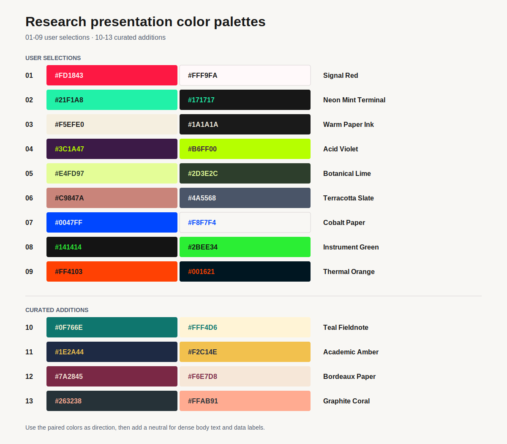

# 연구 발표 색상 팔레트

자료의 목적에 맞게 고르는 2색 팔레트 모음이다. 01-09는 사용자가 수집한 조합이고,
10-13은 이 컬렉션의 빈 자리를 메우기 위해 추가한 후보다. 색 두 개만으로 모든 화면을
만들기보다, 본문에는 중립색을 추가하고 이 조합은 배경과 강조의 방향으로 사용한다.

## 빠른 선택

| 목표 | 먼저 볼 팔레트 |
|---|---|
| 긴 논문 리뷰, 저널 클럽, 차분한 학술 발표 | 03, 07, 10, 11 |
| 계산·시뮬레이션·인터랙티브 연구 시각화 | 02, 08, 09, 13 |
| 친환경 촉매, 생체·바이오, 지속가능성 | 05, 10, 12 |
| 강한 표지, 문제 제기, 핵심 결과 강조 | 01, 04, 09 |
| 사람 중심의 이야기, 제안서, 정성적 연구 | 06, 12, 13 |

## 사용 원칙

- 표의 대비값은 두 색을 직접 전경과 배경으로 쓸 때의 WCAG 상대 대비비다.
- `AA`는 일반 본문 텍스트에 사용할 수 있는 수준이고, `AAA`는 매우 안정적인 수준이다.
- `accent-only`는 큰 제목, 도형, 차트, 수치 강조용이다. 본문 텍스트에는 `#171717`,
  `#1A1A1A`, `#F8F7F4` 같은 제3의 중립색을 함께 쓴다.
- 한 화면에서 주색은 대략 70%, 중립색은 25%, 강조색은 5% 정도로 시작한다. 특히 02,
  04, 08의 네온 계열은 강조색을 넓게 깔지 않는다.
- 색만으로 상태, 오류, 그룹을 구분하지 않는다. 라벨, 선 스타일, 패턴 또는 아이콘을
  함께 사용한다.

## Palette atlas

| ID | 색 조합 | 이름 | 분위기와 권장 장면 | 직접 대비 |
|---|---|---|---|---|
| 01 | `#FD1843` + `#FFF9FA` | Signal Red | 대담하고 편집적인 에너지. 표지, 문제 정의, 한 개의 강한 메시지에 좋다. | 3.75, accent-only |
| 02 | `#21F1A8` + `#171717` | Neon Mint Terminal | 계산, 실시간 신호, 실험 장비 같은 미래적·기술적 인상. 어두운 인터랙티브 시각화에 적합하다. | 12.13, AAA |
| 03 | `#F5EFE0` + `#1A1A1A` | Warm Paper Ink | 차분하고 학술적인 종이 질감. 긴 논문 리뷰와 텍스트가 많은 저널 클럽의 기본값으로 좋다. | 15.17, AAA |
| 04 | `#3C1A47` + `#B6FF00` | Acid Violet | 실험적, 바이오테크, 전위차가 큰 콘셉트. 표지나 전환 슬라이드에 강하다. | 12.09, AAA |
| 05 | `#E4FD97` + `#2D3E2C` | Botanical Lime | 친환경, 생체, 유기적·낙관적 인상. 지속가능성, 바이오매스, 환경 촉매에 어울린다. | 10.23, AAA |
| 06 | `#C9847A` + `#4A5568` | Terracotta Slate | 성숙하고 인간적인 따뜻함. 사진, 차트, 정성적 스토리에 쓰되 본문 텍스트 조합으로는 약하다. | 2.53, accent-only |
| 07 | `#0047FF` + `#F8F7F4` | Cobalt Paper | 정밀하고 현대적인 과학·테크 인상. 데이터 그림, 섹션 구분, 기술 발표에 가장 범용적이다. | 5.86, AA |
| 08 | `#141414` + `#2BEE34` | Instrument Green | 계측기, 라이브 대시보드, 시뮬레이션 제어 화면 같은 강한 실험실 인상. | 11.74, AAA |
| 09 | `#FF4103` + `#001621` | Thermal Orange | 열, 에너지, 반응성, 산업적 긴장감. 반응 경로, 핵심 수치, 에너지 관련 이야기에 좋다. | 5.29, AA |
| 10 | `#0F766E` + `#FFF4D6` | Teal Fieldnote | 고요하고 신뢰감 있는 실험 노트의 인상. 방법론, 환경화학, 장기 데이터 발표에 적합하다. | 4.99, AA |
| 11 | `#1E2A44` + `#F2C14E` | Academic Amber | 절제된 학술성에 성과 강조를 더한 조합. 논문 리뷰의 제목, 결론, 핵심 그래프에 좋다. | 8.51, AAA |
| 12 | `#7A2845` + `#F6E7D8` | Bordeaux Paper | 차분하지만 인간적인 생체·의료·분자과학 편집 디자인. 서사형 제안서에도 어울린다. | 7.82, AAA |
| 13 | `#263238` + `#FFAB91` | Graphite Coral | 재료·열·표면과학의 단단함에 사람 냄새를 조금 더한 조합. 연구 결과와 응용 가능성을 잇는 자료에 좋다. | 7.20, AAA |

## Palette-specific notes

### 01. Signal Red

- `#FFF9FA`를 큰 배경으로 두고 `#FD1843`은 제목, 핵심 숫자, 한두 개의 도형에만 쓴다.
- 본문은 `#1A1A1A`를 추가한다. 빨간색을 오류 상태와 동시에 쓰지 않는다.

### 06. Terracotta Slate

- 두 색의 직접 대비가 낮다. 슬라이드 본문은 `#1A1A1A` 또는 `#F8F7F4`로 처리한다.
- 테라코타는 사진 위의 프레임, 데이터 계열, 사람·응용 이야기를 잇는 장식 요소에 적합하다.

### 02, 04, 08. High-energy dark palettes

- 네온색은 한 화면의 5% 안팎에 한정하고, 중간 회색을 보조 계층으로 추가한다.
- 대시보드나 인터랙티브 도구에는 적합하지만, 30분 이상 읽는 발표의 전체 배경으로는 피로할 수 있다.

## Selection workflow for an agent

1. 자료가 긴 독서형인지, 데이터 중심인지, 인터랙티브 도구인지 먼저 분류한다.
2. 위 빠른 선택에서 1개를 후보로 고른다.
3. 본문·보조·강조·오류 상태에 각각 어떤 색을 쓸지 역할을 적는다.
4. 직접 텍스트 대비가 낮으면 중립색을 추가하고, 색만으로 의미를 구분하지 않는다.
5. 최종 슬라이드나 웹 화면을 렌더링해서 실제 가독성을 검수한다.

## Test notes

- 13개 조합은 수치 대비와 의도된 사용 맥락을 기준으로 1차 정리했다.
- 실제 논문 리뷰, 연구 미팅, 웹 시각화에서 사용한 뒤 선호도와 가독성 메모를 추가한다.
- 반복적으로 효과가 검증된 팔레트만 향후 발표 제작 Skill의 기본값 후보로 승격한다.
